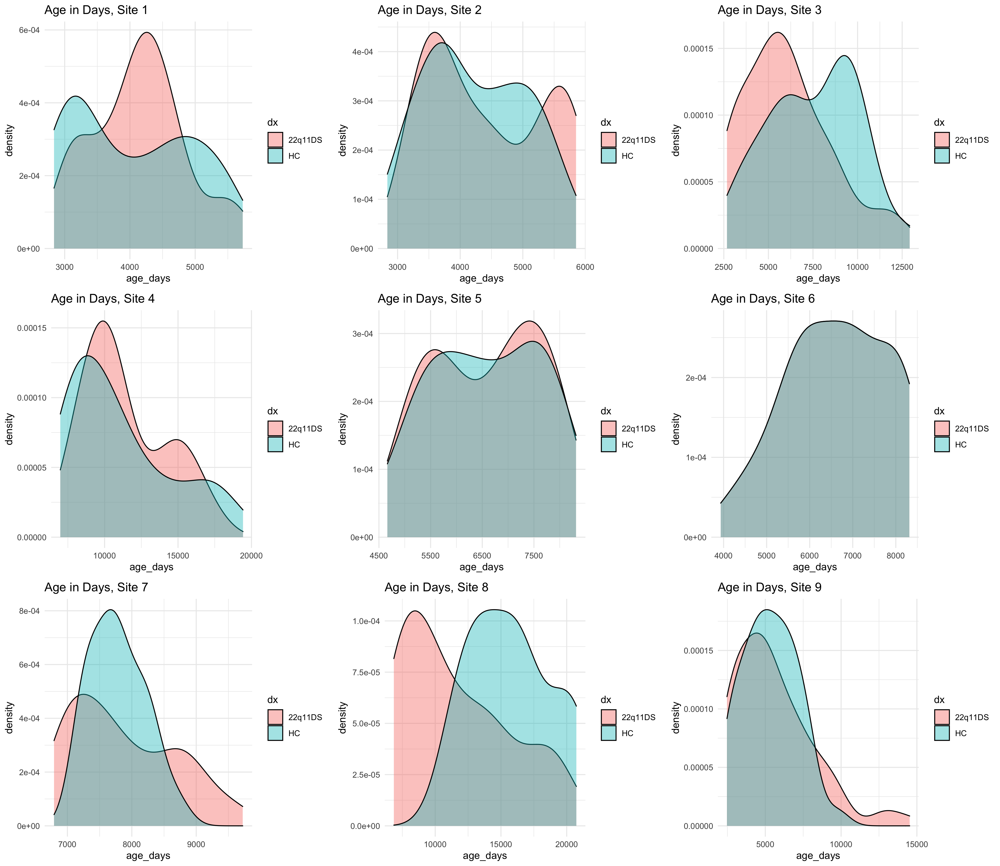

## Initial Data

The following table contains the counts of sex and diagnosis for each site

| Site | Sex: Female (Male) | Diagnosis: Control (Case) |
|------|--------------------|---------------------------|
|    1 |            46 (52) |                   43 (55) |      
|    2 |            55 (60) |                   47 (68) |
|    3 |            34 (31) |                   27 (38) |
|    4 |            29 (43) |                   44 (28) |
|    5 |            22 (17) |                   19 (20) |
|    6 |            40 (60) |                   50 (50) |
|    7 |            32 (43) |                   20 (55) |
|    8 |            34 (31) |                   12 (53) |
|    9 |            58 (57) |                   42 (73) |




## Cleaned Data

The reduce the impact of statistically significant relationships between covariates, any sites with a p-value for the covariates of interest underwent nearest neighbor matching using R's `matchit` library. 

```r
plots <- list()
matchedData <- list()
pvals <- data.frame(row.names = sort(unique(mydata$site)))
for(s in sort(unique(mydata$site))){
  tempdata <- mydata[mydata$site == s,]
  
  ageDxVal <- t.test(age_days~dx, tempdata)$p.value
  ageSexVal <- t.test(age_days~sex, tempdata)$p.value
  sexDxVal <- chisq.test(tempdata$sex, tempdata$dx)$p.value
  
  # If any of the sites have significant p-values, need to use matching to filter out the outliers
  if (ageDxVal < 0.05  || ageSexVal < 0.05 || sexDxVal < 0.05) {
    
    m.out.nn <- matchit(dx ~ age_days + sex, data=tempdata, method="nearest", distance="glm")
    tempdata <- match.data(m.out.nn)
    
    # plot(summary(m.out.nn), method="jitter")
    
    ageDxVal <- t.test(age_days~dx, newData)$p.value
    ageSexVal <- t.test(age_days~sex, newData)$p.value
    sexDxVal <- chisq.test(newData$sex, newData$dx)$p.value
  }

  pvals[s, "age.vs.dx"] <- ageDxVal
  pvals[s, "age.vs.sex"] <- ageSexVal
  pvals[s, "sex.vs.dx"] <- sexDxVal
  
  matchedData[[s]] <- tempdata
  
  # Make the plot
  plots[[s]] <- ggplot(data=tempdata, mapping = aes(x=age_days, group=dx, fill=dx)) +
    geom_density(alpha=.4) +
    theme_minimal() +
    ggtitle(paste0("Age in Days, Site ", s))
}
```

Only 3 sites had statistically significant relationships between covariates. The distributions of coviarates are as follows after performing matching on those sites.

| Site | Sex: Female (Male) | Diagnosis: Control (Case) |
|------|--------------------|---------------------------|
|    3 |            30 (24) |                   27 (27) |
|    7 |            32 (43) |                   20 (55) |
|    8 |             9 (15) |                   12 (12) |


