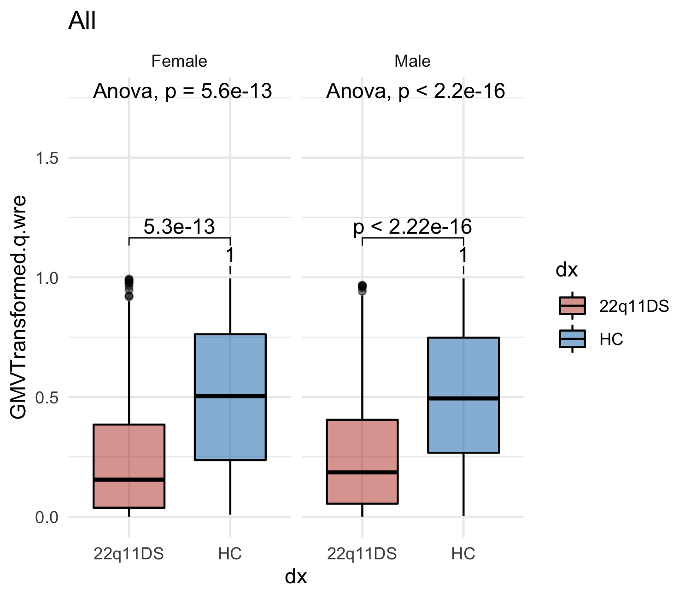
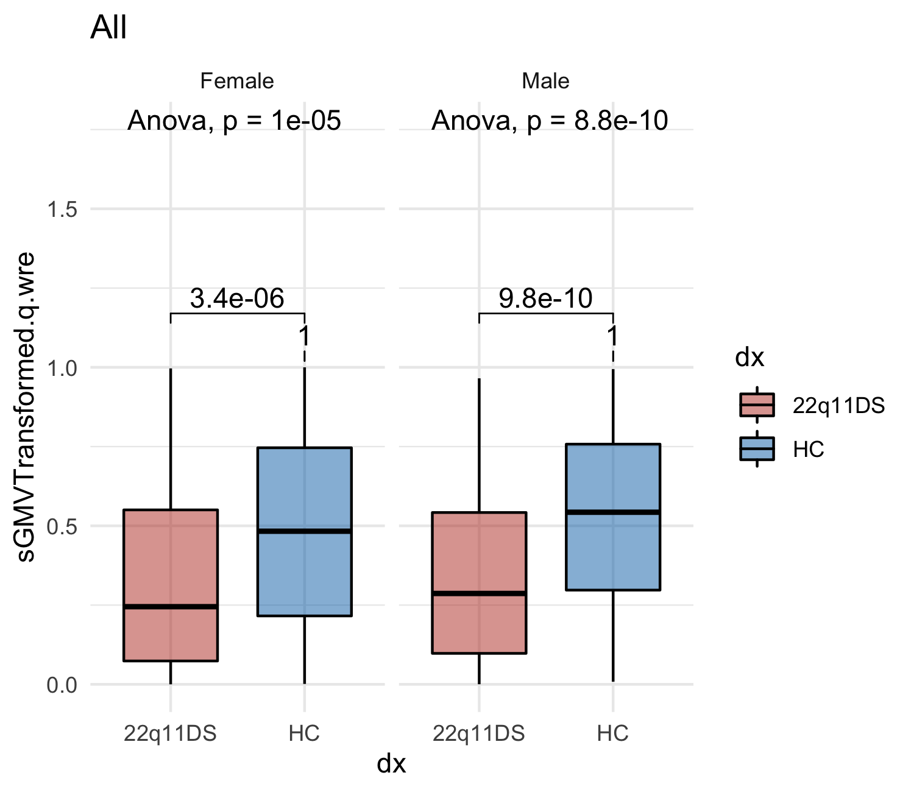
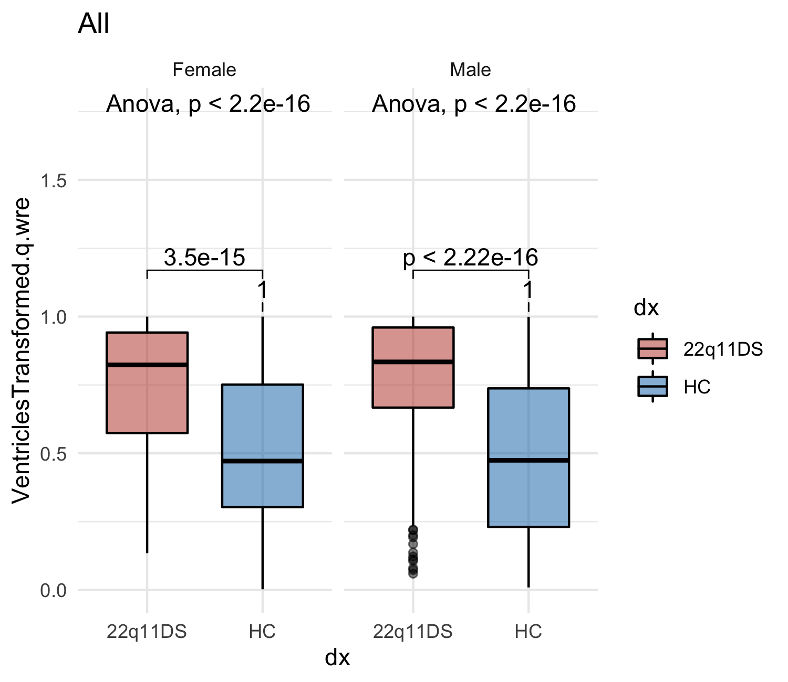
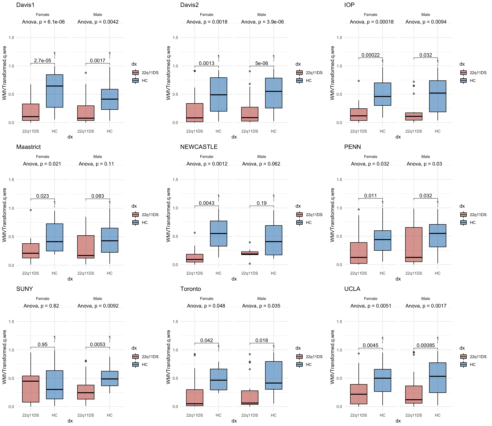
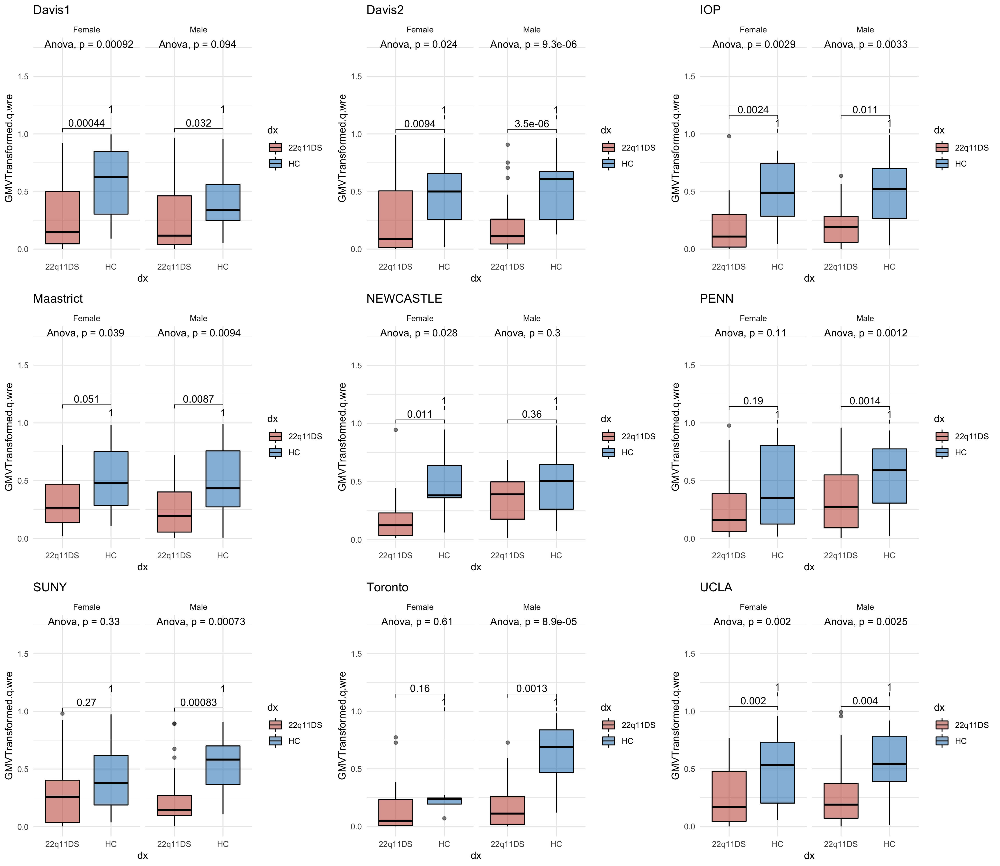
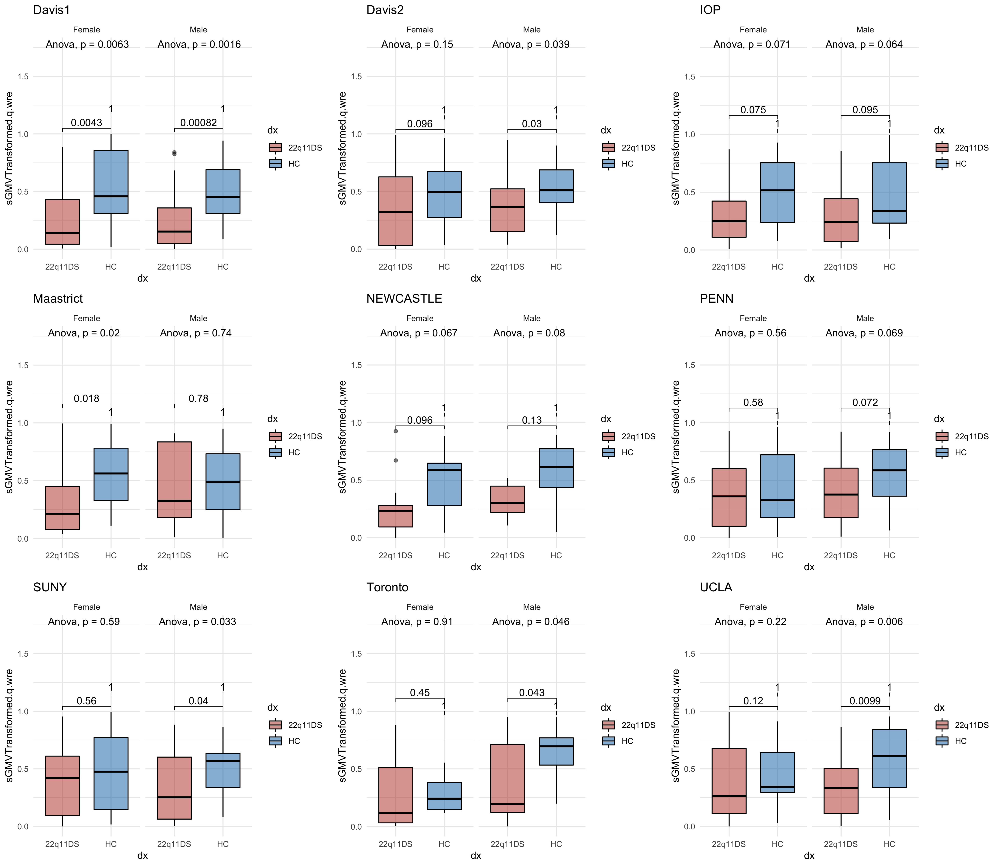
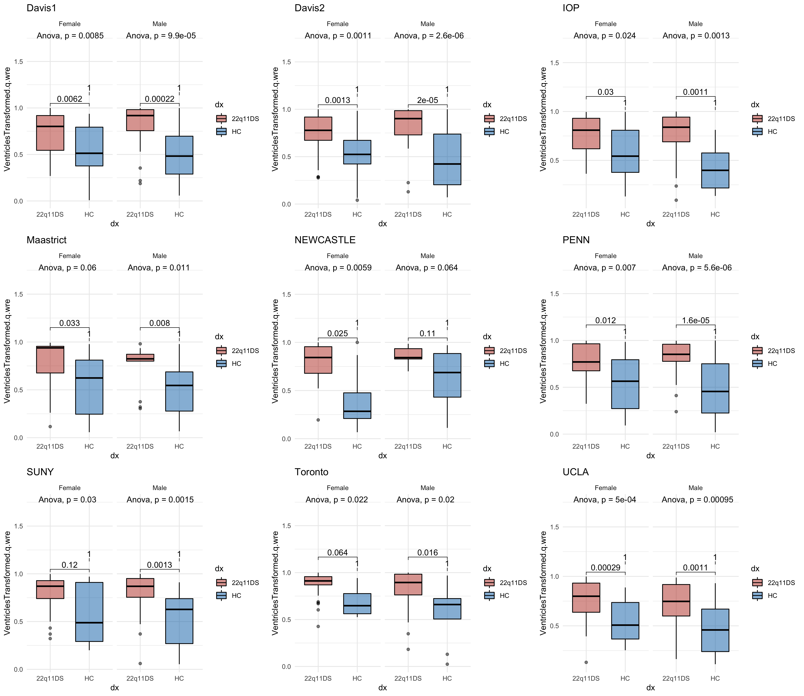

# Life is an Enigma

## Overview

[Disease Effects](#disease-effects)

## Disease Effects

### Disease Effects Across All Sites, Divided by Sex

White Matter

Gray Matter

Subcortical Gray Matter

Cerebrospinal Fluid

### Disease Effects At Individual Sites, Divided by Sex

