## Overview

This page is divided into two main sections: whole population and site populations. In each section, there are subsections for the disease and sex effects as well as the age models.

## Whole Population

### Disease Effect

For male and female subjects, compare the morphometry of the brains of healthy and ill populations.

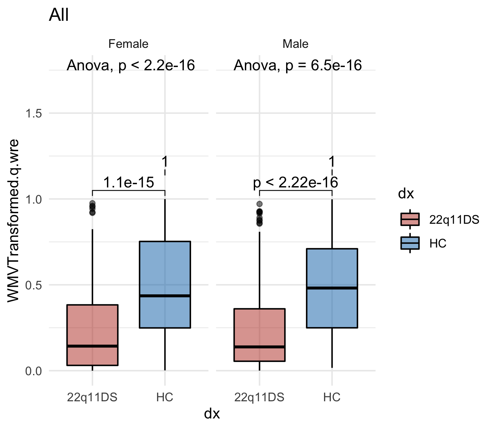

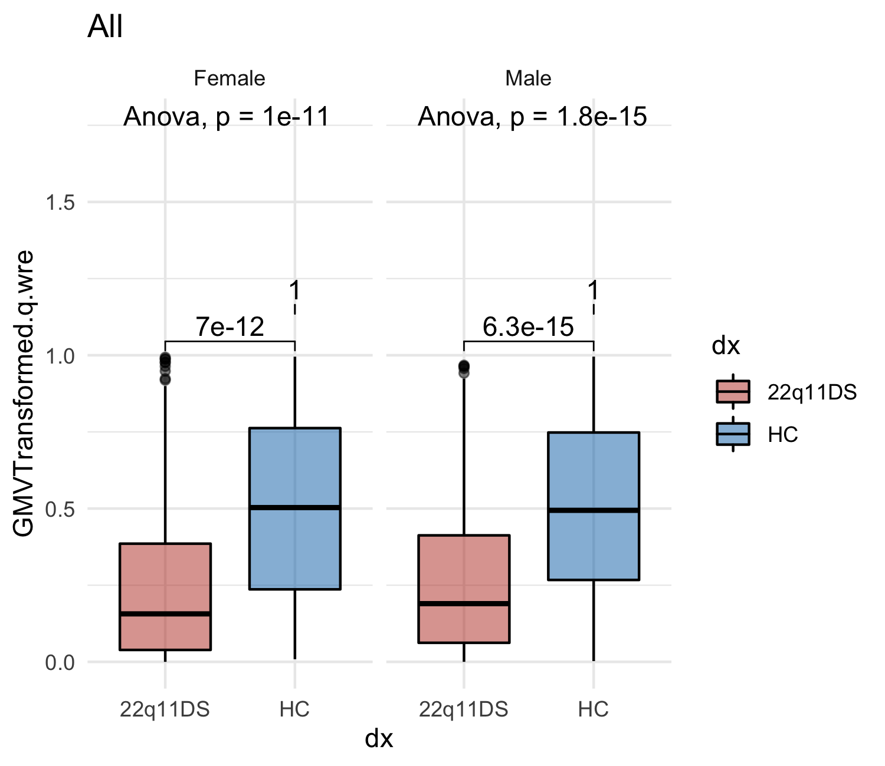

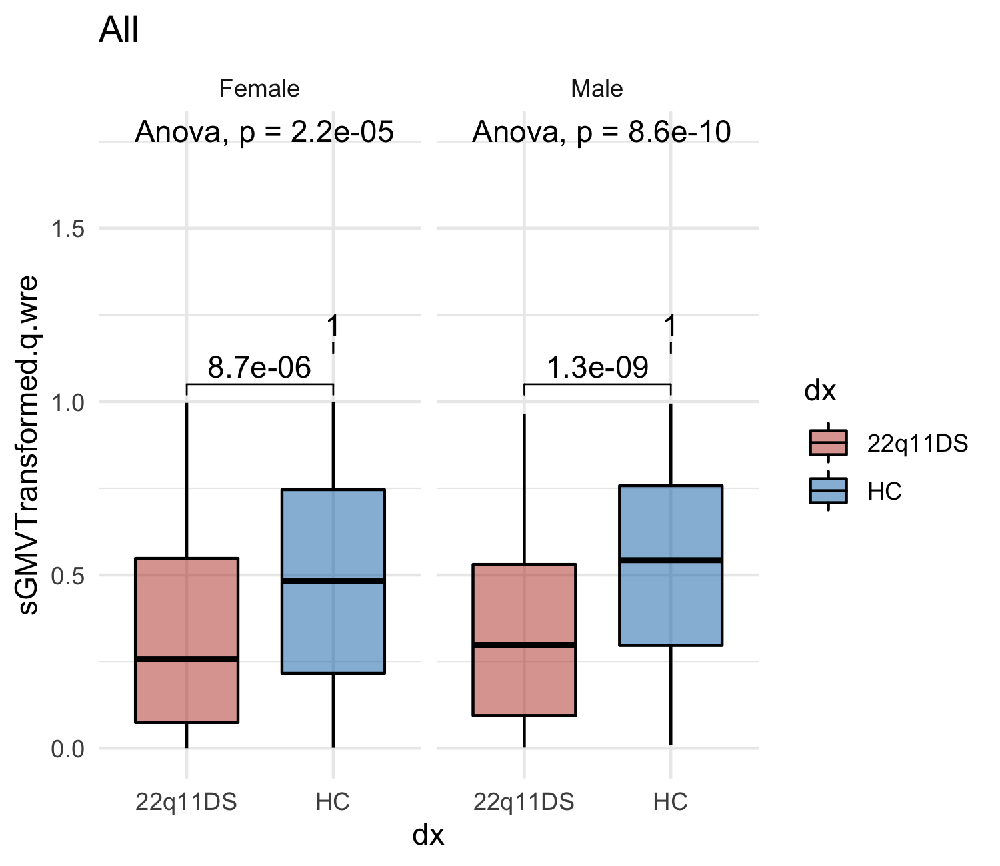

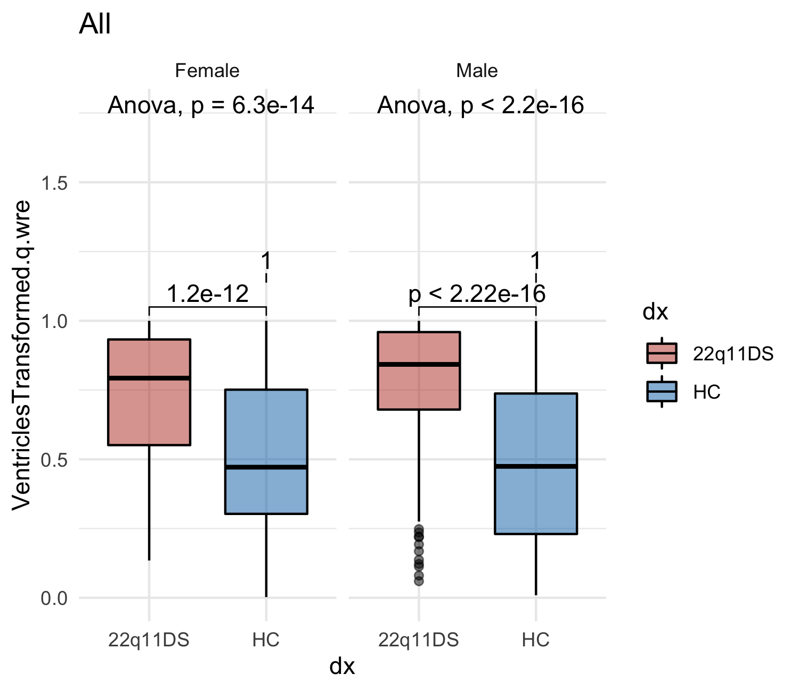

### Sex Effect

For healthy and ill subjects, compare the morphometry of the brains of male and female populations.

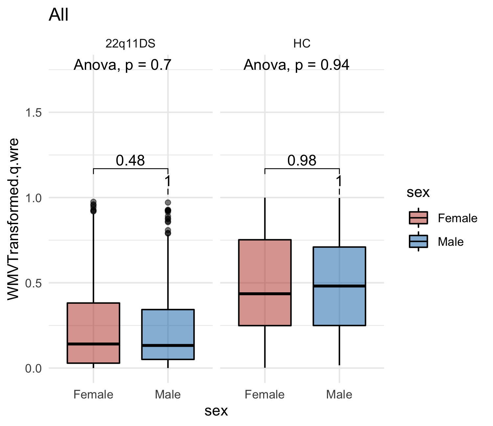

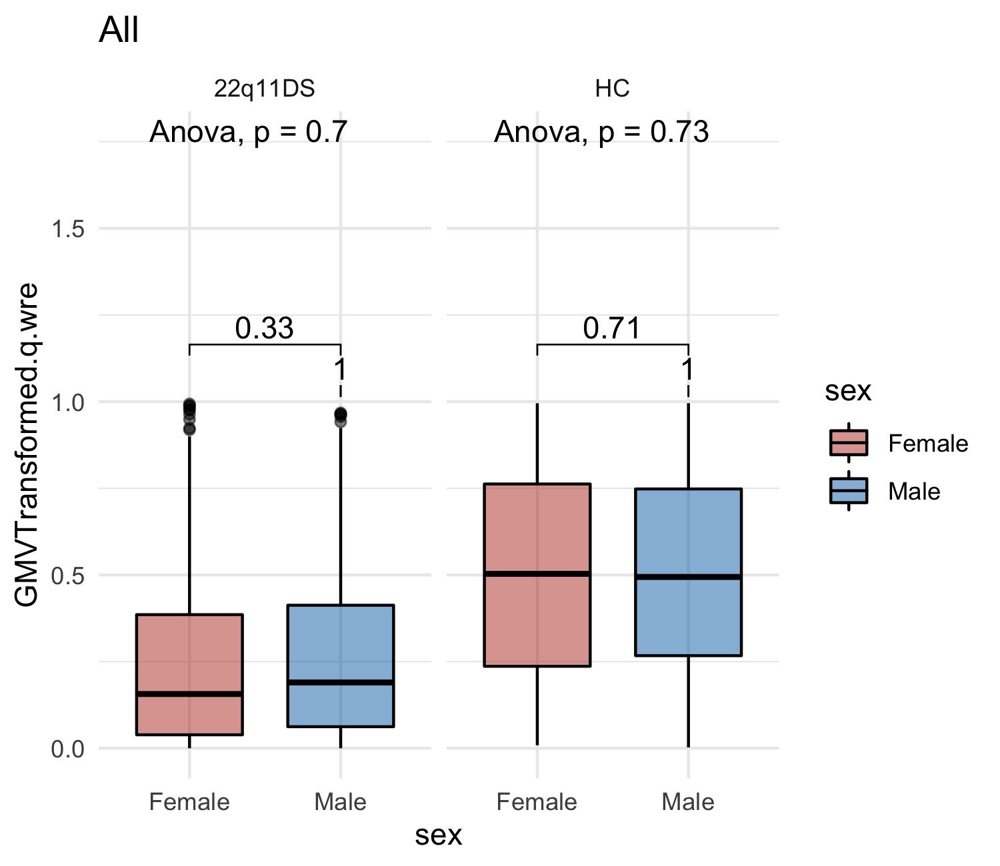

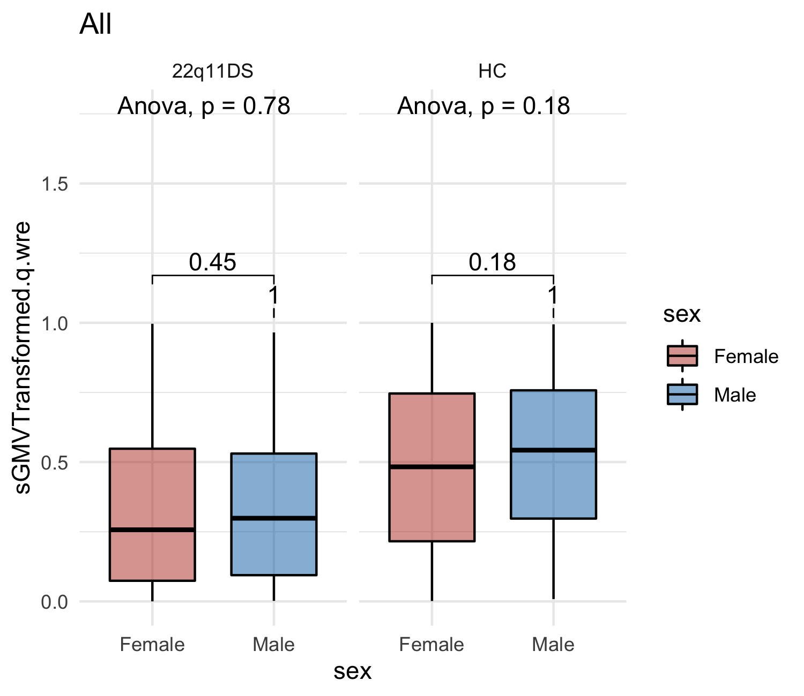

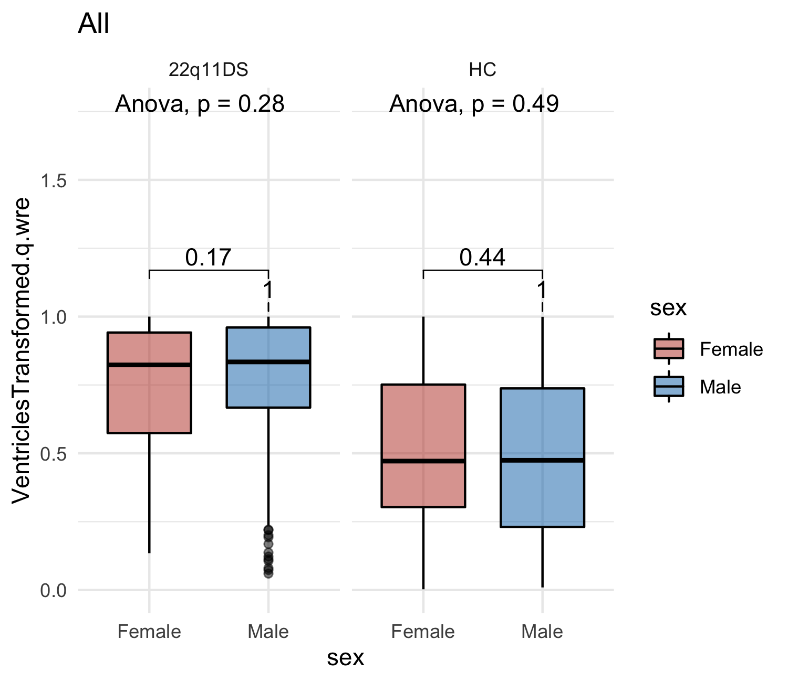

### Age Models

*Naive Linear Models*

Plot relationship between morphometry and age.

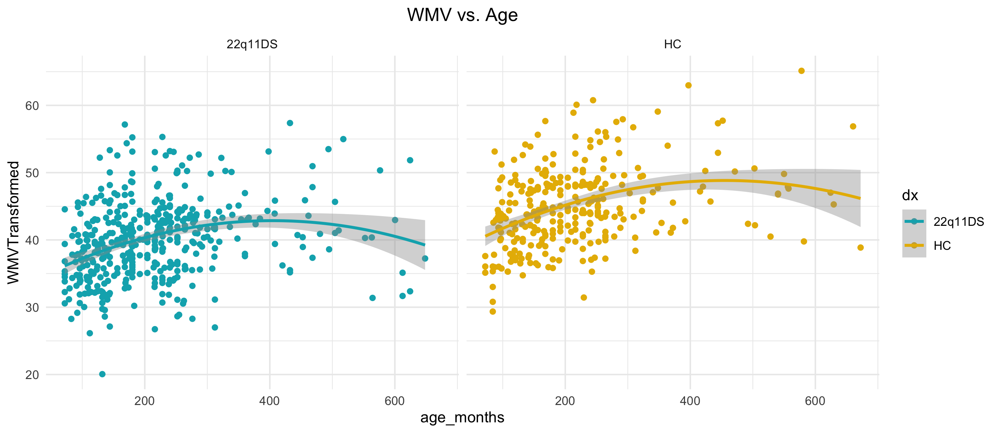

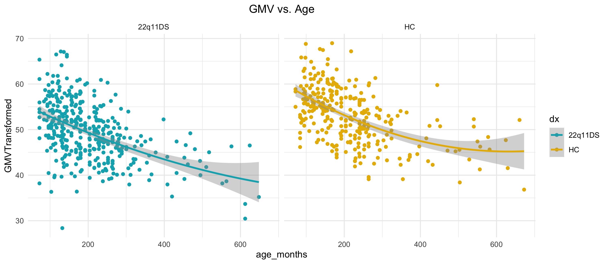

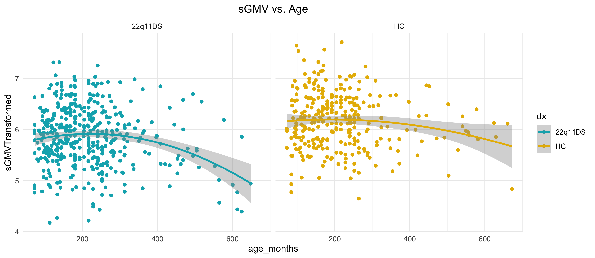

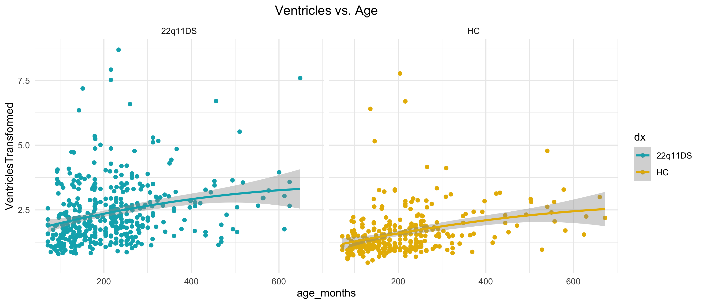

*GAMLSS Models*

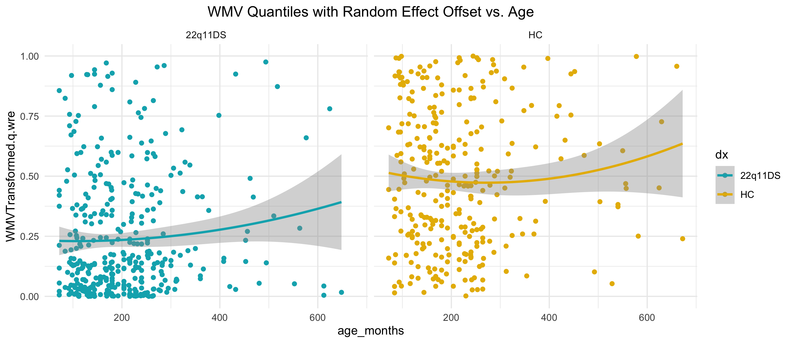

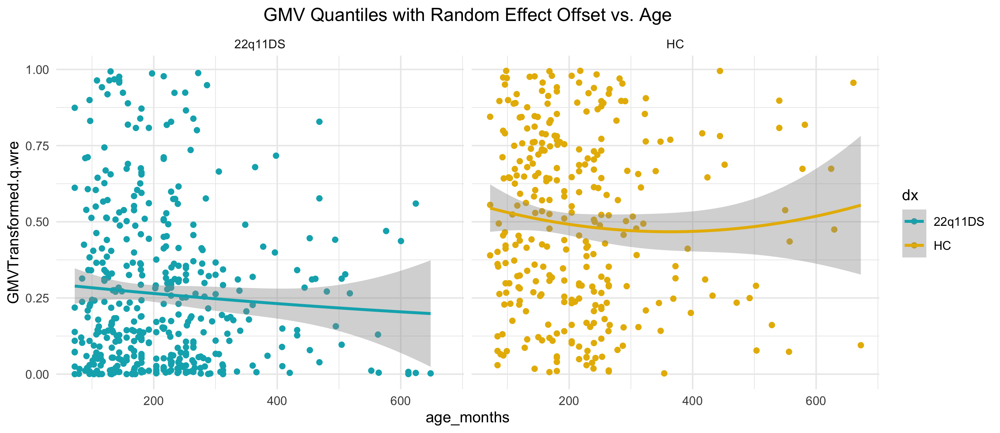

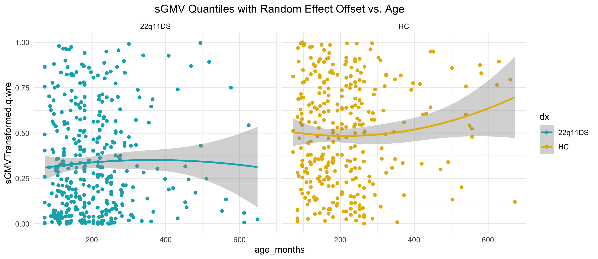

