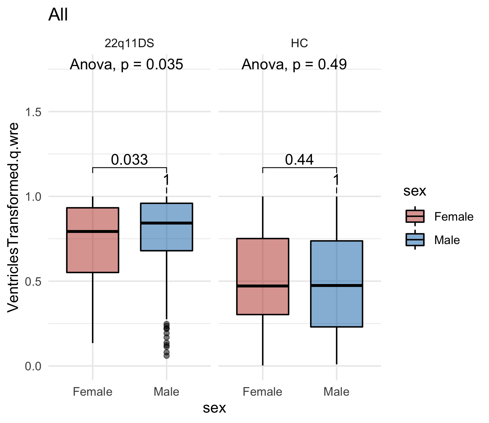
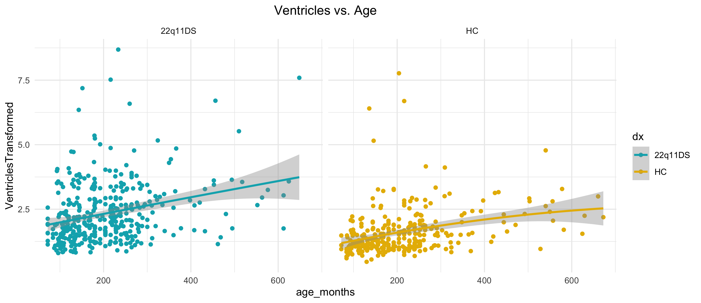
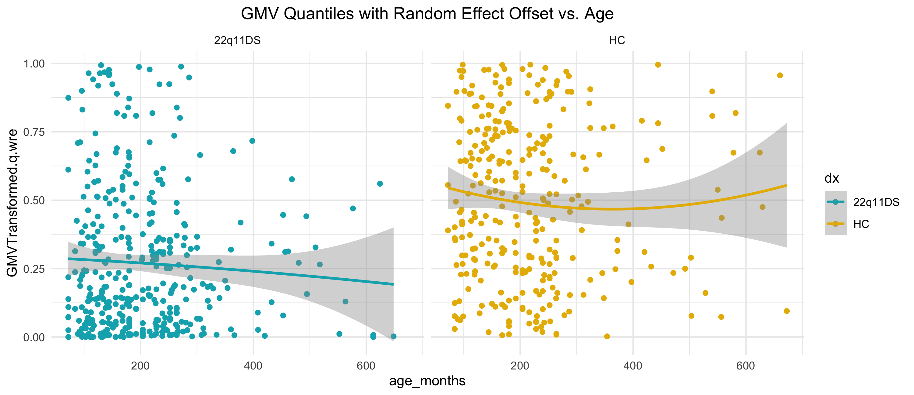
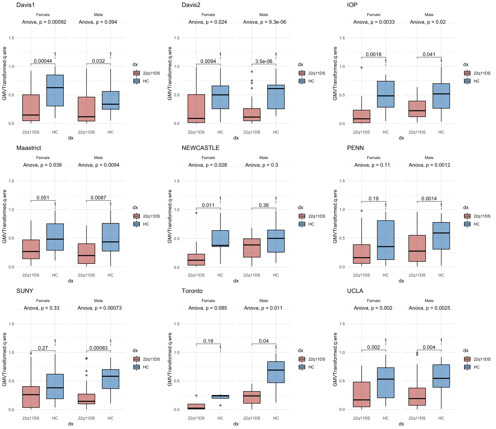
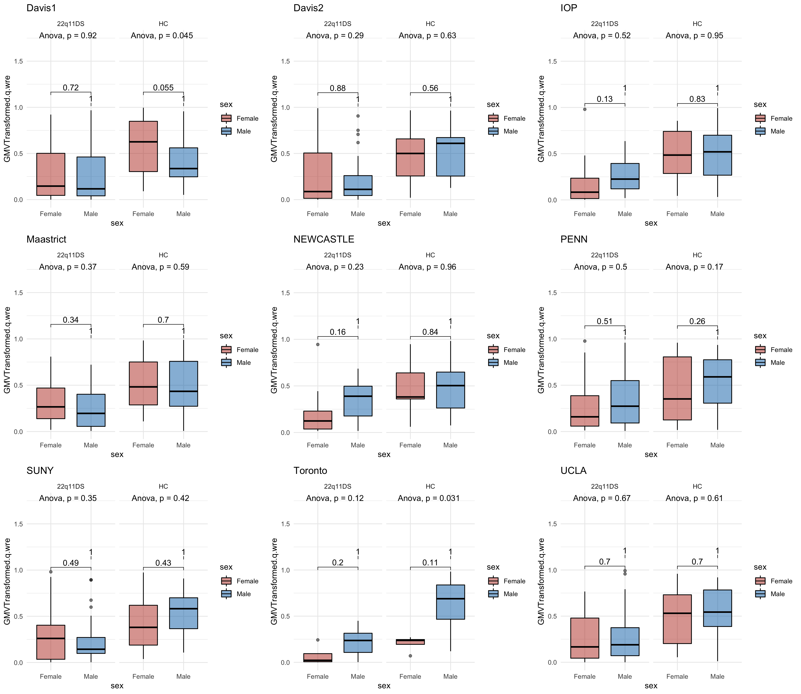

## Overview

This page is divided into two main sections: whole population and site populations. In each section, there are subsections for the disease and sex effects as well as the age models.

## Whole Population

### Disease Effect

For male and female subjects, compare the morphometry of the brains of healthy and ill populations.

*White Matter Volume*

*Gray Matter Volume*

*Subcortical Gray Matter Volume*

*Ventricle Volume*

### Sex Effect

For healthy and ill subjects, compare the morphometry of the brains of male and female populations.

*White Matter Volume*

*Gray Matter Volume*

*Subcortical Gray Matter Volume*

*Ventricle Volume*

### Age Models

**Naive Linear Models**

Plot relationship between morphometry and age.

*White Matter Volume*

*Gray Matter Volume*

*Subcortical Gray Matter Volume*

*Ventricle Volume*

**GAMLSS Models**

*White Matter Volume*

*Gray Matter Volume*

*Subcortical Gray Matter Volume*

*Ventricle Volume*

---

## Site Level Comparisons

### Disease Effect

For male and female subjects, compare the morphometry of the brains of healthy and ill populations.

*White Matter Volume*

*Gray Matter Volume*

*Subcortical Gray Matter Volume*

*Ventricle Volume*

### Sex Effect

For healthy and ill subjects, compare the morphometry of the brains of male and female populations.

*White Matter Volume*

*Gray Matter Volume*

*Subcortical Gray Matter Volume*

*Ventricle Volume*

### Age Models

**Naive Linear Models**

Plot relationship between morphometry and age.

*White Matter Volume*

*Gray Matter Volume*

*Subcortical Gray Matter Volume*

*Ventricle Volume*

**GAMLSS Models**

*White Matter Volume*

*Gray Matter Volume*

*Subcortical Gray Matter Volume*

*Ventricle Volume*

