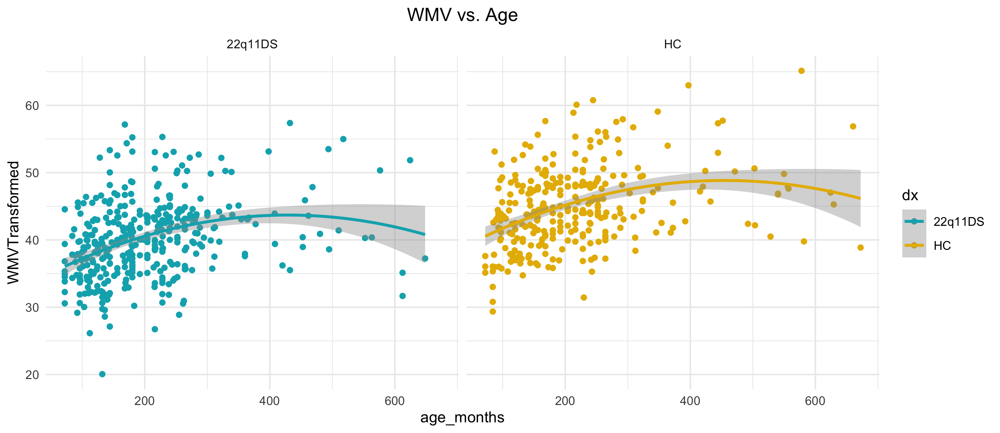
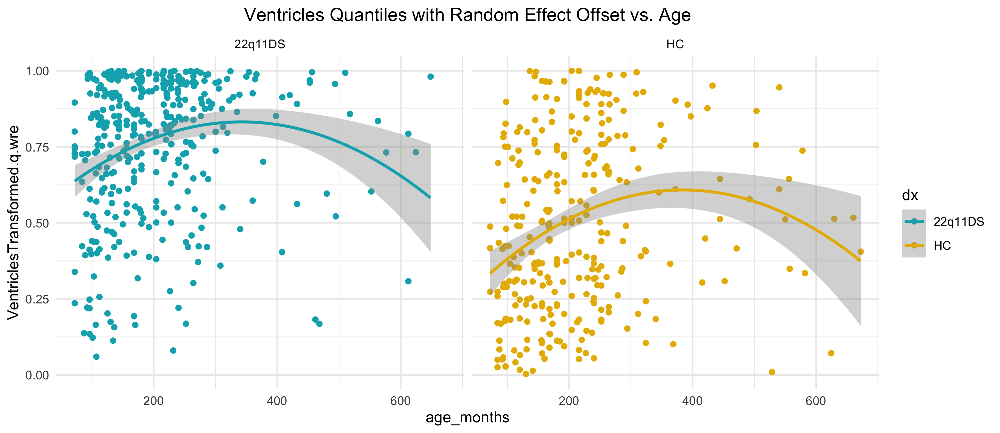
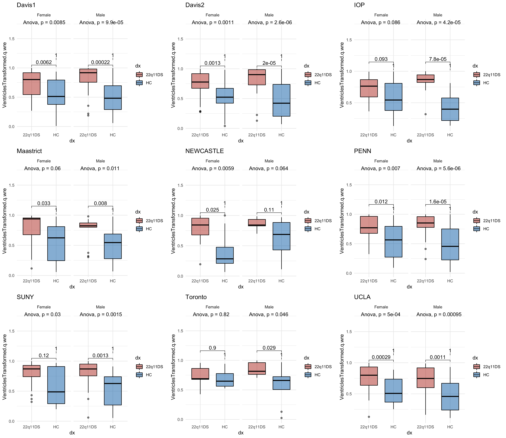
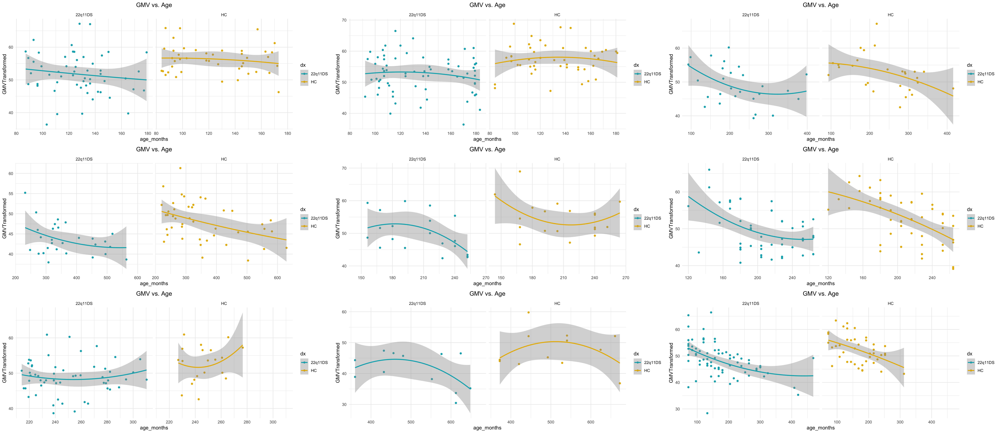
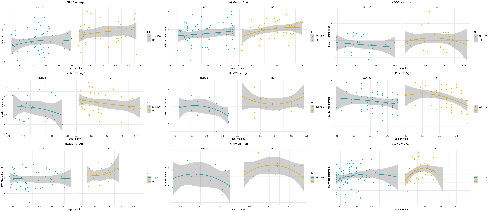
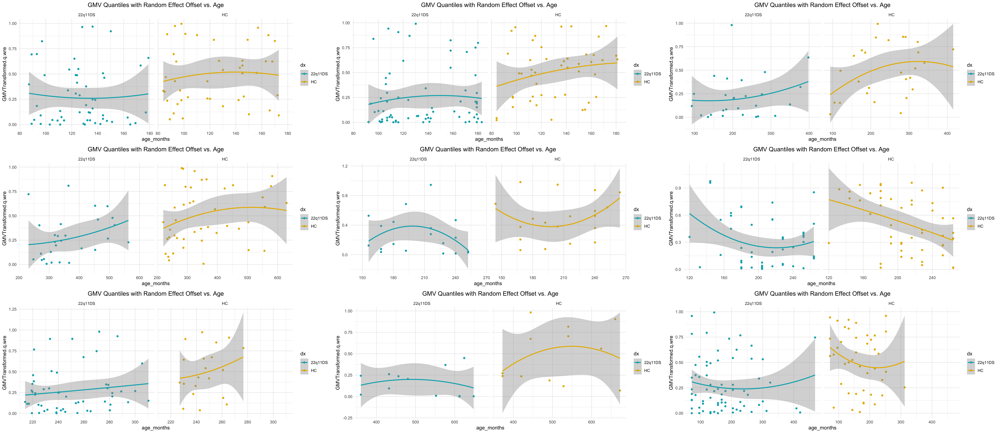

## [Methods](#top)

The statistical analysis overall was performed by normalizing the data and then performing statistical tests on different features of the normalized data. The data was normalized usingcentile models generated the [Lifespan](https://github.com/ucam-department-of-psychiatry/Lifespan) pipeline for healthy subjects. In this section, we consider an out of sample analysis: we use the existing models as a baseline and calculate the offsets from our data to those models.

This page is divided into three main sections: 

- [whole population with normalization ignoring sites](#whole-population-normalization-ignoring-sites)
- [whole population with normalization incorporating sites](#whole-population-normalization-incorporating-sites)
- [site populations with normalization incorporating sites]

The normalization process uses a previously trained statistical model of one of four brain morphometrics: white matter volume, gray matter volume, subcortical gray matter volume, and volume of cerebrospinal fluid in the ventricles. The preexisting model and a data frame containing covariates and raw morphometries for new data are passed to the following function. The function uses the model as a baseline and normalizes the new data to it.

```r
## Calculate quantiles for the new dataset based on existing model
# @param newdat A dataframe containing covariate and brain measure information for new subjects
# @param PRIMARY A previous iteration of the Lifespan Model
# @return NOVEL A data frame with the results of the "out of sample" code on new data
runOutOfSampleData <- function(newdat, PRIMARY){

  NOVEL <- Apply.Param(NEWData=newdat,
                       FITParam=PRIMARY$FIT.EXTRACT$param,
                       Reference.Holder=PRIMARY,
                       Pred.Set=NULL, Prefix="", Add.Moments=FALSE, Add.Normalise=FALSE, Add.Derivative=FALSE, MissingToZero=TRUE,
                       verbose=FALSE )

  NOVEL <- NOVEL[ attr(NOVEL,"logical.selectors")$REFIT.VALID, ]

  EXPANDED <- Calc.Expanded(NewData=NOVEL,
                            Cur.Param=PRIMARY$FIT.EXTRACT$param,
                            Missing=attr(NOVEL,"missing.levels") )

  NOVEL <- Apply.Param(NEWData=newdat,
                       Reference.Holder=PRIMARY,
                       FITParam=EXPANDED,
                       Pred.Set=c("l025"=0.025,"l250"=0.250,"m500"=0.5,"u750"=0.750,"u975"=0.975),
                       Prefix="",
                       Add.Moments=FALSE, ## does not make sense for observations
                       Add.Normalise=TRUE,
                       Add.Derivative=FALSE,  ## does not make sense for observations
                       MissingToZero=TRUE, NAToZero=TRUE,
                       verbose=FALSE )

  NOVEL$quantile <- NOVEL[,paste0(feature_select,"Transformed.q.wre")]

  return(NOVEL)
}

```

The new data parameter for this function varies depending on the desired type of normalization. 

In the following sections, there are subsections for the disease and sex effects as well as the age models.

## Whole Population: Normalization Ignoring Sites

In R, the normalization ignoring sites uses two functions.

```r
# Ignoring site
NOVEL <- runOutOfSampleData(newdat, PRIMARY)
```

The function `runOutOfSampleData(newdat, PRIMARY)` takes a data frame and a previously generated normative model for a given brain morphometry.


### Disease Effect

For male and female subjects, compare the morphometry of the brains of healthy and ill populations.

*White Matter Volume*


*Gray Matter Volume*


*Subcortical Gray Matter Volume*


*Ventricle Volume*


### Sex Effect

For healthy and ill subjects, compare the morphometry of the brains of male and female populations.

*White Matter Volume*


*Gray Matter Volume*


*Subcortical Gray Matter Volume*


*Ventricle Volume*


### Age Models

**Naive Linear Models**

Plot relationship between morphometry and age.

*White Matter Volume*



*Gray Matter Volume*


*Subcortical Gray Matter Volume*


*Ventricle Volume*


**GAMLSS Models**

*White Matter Volume*


*Gray Matter Volume*


*Subcortical Gray Matter Volume*


*Ventricle Volume*



---

## [Whole Population Figures: Site Level Normalization](#whole-population-normalize-sites)

---

## [Site Level Comparisons: Site Level Normalization](#site-level-comparisons)

### Disease Effect

For male and female subjects, compare the morphometry of the brains of healthy and ill populations.

*White Matter Volume*


*Gray Matter Volume*


*Subcortical Gray Matter Volume*


*Ventricle Volume*




### Sex Effect

For healthy and ill subjects, compare the morphometry of the brains of male and female populations.

*White Matter Volume*


*Gray Matter Volume*


*Subcortical Gray Matter Volume*


*Ventricle Volume*


### Age Models

**Naive Linear Models**

Plot relationship between morphometry and age.

*White Matter Volume*


*Gray Matter Volume*



*Subcortical Gray Matter Volume*



*Ventricle Volume*


**GAMLSS Models**

*White Matter Volume*


*Gray Matter Volume*



*Subcortical Gray Matter Volume*


*Ventricle Volume*


